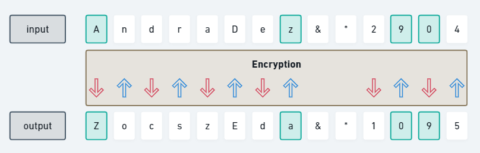
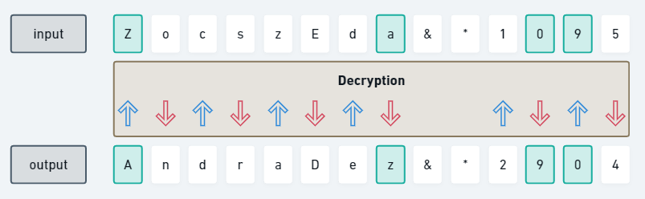

# encripdrador

Encripdrador is a tool to encrypt and decrypt passwords based on Andrade's cryptography.

## How Andrade's cryptography works?

## Encryption

The letters are alternaly decreased and increased following the ASCII table:  
The 1° letter is decreased 
The 2° letter is increased 
The 3° letter is decreased 
The 4° letter is increased 
...

### Example

For this password input: AndraDez&*2904

The password output is: ZocszEda&*1095

Note that in this encryption, 4 [special cases](#special-cases) happened:
- DSC 1
- ISC 2
- ISC 3
- DSC 3

## Decryption

We do the opposite way:  
The letters are alternaly increased and decreased following the ASCII table:  
The 1° letter is increased 
The 2° letter is decreased 
The 3° letter is increased 
The 4° letter is decreased 
...

### Example

For this password input: ZocszEda&*1095

The password output is: AndraDez&*2904

Note that in this encryption, 4 [special cases](#special-cases) happened:
- ISC 1
- DSC 2
- DSC 3
- ISC 3

## Rules

- Uppercase letters are maintained uppercase
- Undercase letters are maintained undercase
- Symbols (@, #, $, %, !, ~, etc) are kept the same

## Special cases

Increasing Special Cases (ISC):
1. Z -> A
2. z -> a
3. 9 -> 0

Decreasing Special Cases (DSC):
1. A -> Z
2. a -> z
3. 0 -> 9

## Status

Under development 🚧